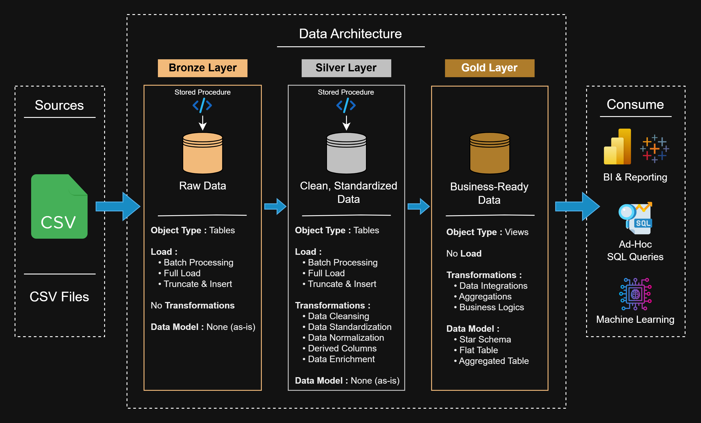

# 🛒 BigBasket Quick Commerce Analytics  
**End-to-End SQL → Power BI Data Analytics Project**

---

## 📌 Problem Statement

Quick-commerce businesses generate large volumes of transactional, marketing, delivery & customer feedback data.  
However, raw operational data is often **messy, inconsistent & siloed**, making it difficult for stakeholders to:

- Track reliable KPIs  
- Underst& customer behavior  
- Measure marketing effectiveness  
- Monitor delivery performance  
- Make data-driven decisions quickly  

This project solves that problem by building a **production-style analytics pipeline** & **business-ready dashboards** using SQL & Power BI.

---

## 🎯 What This Project Delivers

- A **retail-grade SQL data warehouse** built using Medallion Architecture  
- Clean, validated, & modeled data ready for analysis  
- Advanced analytical queries answering real business questions  
- Interactive **Power BI dashboards** for executives, marketing, operations, & CX teams  
- A reusable analytics foundation similar to real-world data analyst workflows  

---

## 🧱 Data Architecture (SQL)



**Bronze Layer:** Raw CSV data ingestion, all fields as-is for traceability.  
**Silver Layer:** Cleansed, st&ardized tables with derived columns & validated business logic.  
**Gold Layer:** Star schema views & aggregated tables for high-performance analytical querying. 

---

## 🧩 Gold Layer ER Diagram

 

---

## 🗂️ Repository Structure

```text
bigbasket-quick-commerce-analytics/
│
├── dataset/                    # Raw CSV datasets
│
├── scripts/
│   ├── bronze/                 # Raw ingestion scripts
│   ├── silver/                 # Cleaning & transformation scripts
│   ├── gold/                   # Star schema & analytical views
│
├── eda_queries/                # Exploratory analysis SQL
├── advanced_analytics/         # Advanced business analysis SQL
├── tests/                      # Data quality & logic testing (silver layer)
│
├── power_bi/
│   ├── BigBasket_QuickCommerce_Analytics.pbix
│   ├── screenshots/
│   └── BigBasket_QuickCommerce_PowerBI_Report.pdf
│
├── diagrams/                   # Architecture & ER diagrams
└── README.md
```

---

## 🚀 Project Highlights

- Retail-optimized star schema with fact & dimension modeling
- Automated SQL pipeline using stored procedures
- Robust data quality checks (nulls, duplicates, etc.) before transformations
- Modular, reusable SQL queries for scalability
- Advanced analytics covering sales, customers, marketing, delivery, & sentiment
- Seamless SQL → Power BI integration using Gold layer

---

## 📈 Exploratory Data Analysis (EDA) – What Was Explored

- Monthly trends in customer registrations, orders, & revenue
- Average Order Value (AOV) & spending behavior
- Relationship between marketing spend & revenue
- Customer segmentation using RFM & tenure
- Top customers & products by revenue & frequency
- Delivery efficiency & service quality metrics
- Cohort & cumulative analysis for retention tracking

---

## 🧪 Advanced Analysis – What Was Investigated

- Month-over-Month (MoM) & Year-over-Year (YoY) revenue growth
- Peak ordering hours & weekdays
- Weekday vs weekend dem& patterns
- High-dem& & high-margin product identification
- Channel & campaign-level marketing performance
- Impact of delivery delays on customer sentiment
- Customer Lifetime Value (CLV) analysis by tenure & payment method

---

## 📊 Power BI Dashboard Suite


The Power BI report is built directly on top of the SQL Gold layer, ensuring:

- Single source of truth for KPIs
- High performance & consistent metrics
- Clear separation of data modeling & visualization

Dashboards Included
- Executive Overview – Revenue, profit, orders, on-time delivery
- Product Performance – Margins, top/bottom products, pricing impact
- Customer Analytics – RFM segments, CLV, frequency & recency
- Marketing Performance – ROI, channels, funnels, campaign efficiency
- Delivery & Operations – On-time %, delays, partner benchmarking
- Feedback & Sentiment – Ratings, sentiment trends, issue analysis

## 🧮 The report uses a rich DAX layer & interactive features:

DAX measures like:
- Avg Order Value, Avg CLV, Cost per Conversion, On Time %, Avg Delivery Delay, Negative Rating %, etc.

Relationships & filters
- Proper relationships between orders, items, customers, campaigns & feedback to enable cross-page filtering.
- Visual-level, page-level & report-level filters tuned to keep each page focused while preserving global slicers (Year, Month, Channel, etc.).

UX features

- Bookmarks & buttons for navigation & "Clear Filters" actions.
- Role-based L&ing page with tiles for each dashboard.
- Consistent color palette, card design & typography across all pages.

---

## 💼 Business Impact & Use Cases

This project supports decision-making for:
- Marketing budget optimization
- Customer retention & loyalty strategy
- Inventory & product performance planning
- Delivery partner performance management
- Executive-level KPI tracking

---

## ⚠️ Important Notes

- Built & tested using SQL Server Express
- Scripts must be executed in the following order: ``` Bronze → Silver → Gold → EDA → Advanced Analytics ```
- Silver layer tests should be executed before loading transformations

---

## 👤 Author

**Rohit Yadav**  
📧 rohit.ydvv23@gmail.com  
🔗 [LinkedIn](https://www.linkedin.com/in/rohittydvv/)
